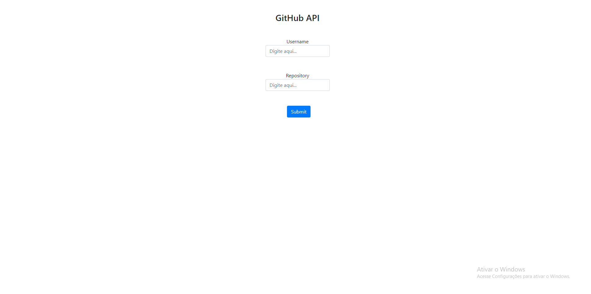

.

#### Daploy

https://elc1090.github.io/project2a-gilson-e-roberto/

#### Desenvolvedores

Gilson Garcia e Roberto Mahl

#### Ambiente de desenvolvimento
- VS Code

#### Créditos

#### Bastidores

Gilson ficou no HTML e Roberto ficou no JavaScript. Os dois já tinham experiências com frameworks, então a experiência de lidar diretamente com o DOM foi super interessante. Visualizar como as coisas funcionam por debaixo dos panos não só é um novo aprendizado como auxilia na compreensão do funcionamento dos frameworks que usamos.

---
Projeto entregue para a disciplina de [Desenvolvimento de Software para a Web](http://github.com/andreainfufsm/elc1090-2023a) em 2023a
